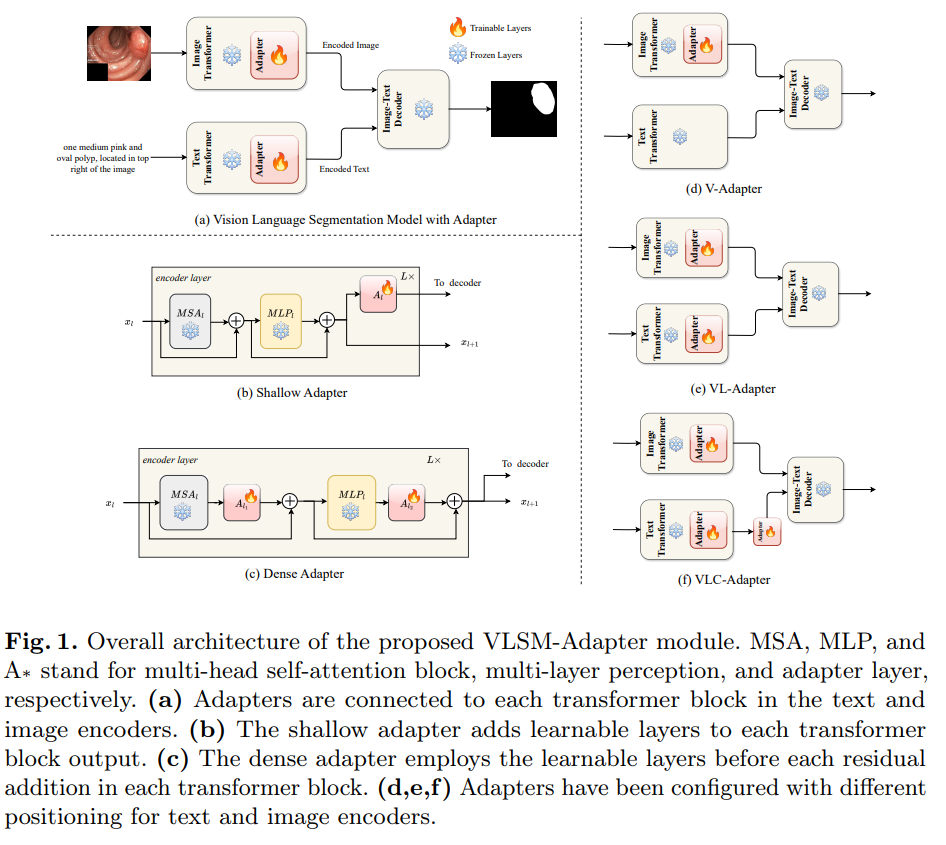
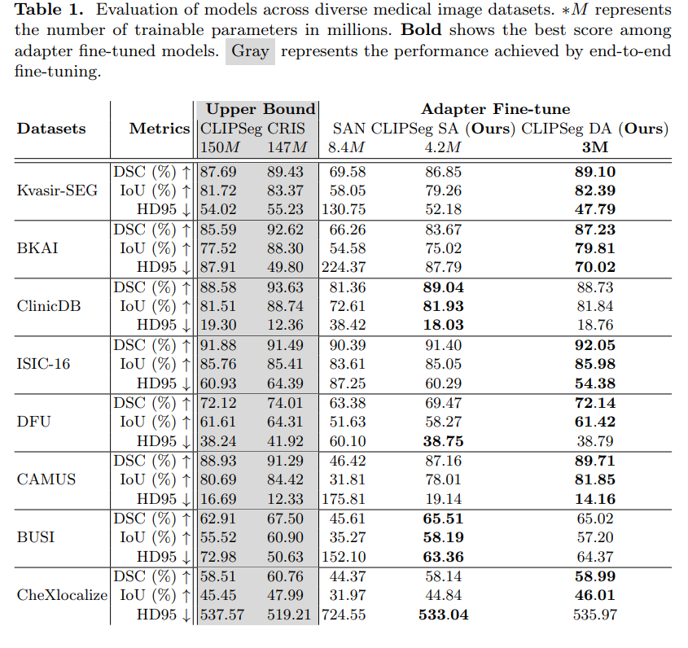

# VLSM-Adapter: Finetuning Vision-Language Segmentation Efficiently with Lightweight Blocks

Accepted at: [MICCAI 2024](https://link.springer.com/chapter/10.1007/978-3-031-72114-4_68)

ArXiv Link: [arxiv.org/abs/2405.06196](https://www.arxiv.org/abs/2405.06196)

## Abstract
Foundation Vision-Language Models (VLMs) trained using large-scale open-domain images and text pairs have recently been adapted to develop Vision-Language Segmentation Models (VLSMs) that allow providing text prompts during inference to guide image segmentation. If robust and powerful VLSMs can be built for medical images, it could aid medical professionals in many clinical tasks where they must spend substantial time delineating the target structure of interest. VLSMs for medical images resort to fine-tuning base VLM or VLSM pretrained on open-domain natural image datasets due to fewer annotated medical image datasets; this fine-tuning is resource-consuming and expensive as it usually requires updating all or a significant fraction of the pretrained parameters. Recently, lightweight blocks called adapters have been proposed in VLMs that keep the pretrained model frozen and only train adapters during fine-tuning, substantially reducing the computing resources required. We introduce a novel adapter, VLSM-Adapter, that can fine-tune pretrained vision-language segmentation models using transformer encoders. Our experiments in widely used CLIP-based segmentation models show that with only 3 million trainable parameters, the VLSM-Adapter outperforms state-of-the-art and is comparable to the upper bound end-to-end fine-tuning.

## Table of Contents
- [Methodology](#methodology)
- [Setup](#setup)
- [Finetuning](#finetuning)
- [Results](#results)

## Methodology
<div style="text-align: center;">
  
</div>

## Setup
Please refer to the [MedVLSM](https://github.com/naamiinepal/medvlsm/) repo for environment setup, pretrained model setup and dataset_preparation.


## Finetuning

If you need to run our fine-tuning models, you can use the provided script:
```bash
python scripts/finetune.py
```

This script will start the fine-tuning process, which is essential for customizing the model for specific tasks. 
In the file, all of the methods have been defined as bash scripts.
For running inference, please update the defaults configs (such as `ckpt_path`, `models`, etc.) in `scripts/inference.py` to get the evulation metric or generate the output masks (in the original resolution).

## Results
<div style="text-align: center;">
  
</div>

## BibTeX Citation
```
@inproceedings{dhakal2024vlsm,
  title={VLSM-Adapter: Finetuning Vision-Language Segmentation Efficiently with Lightweight Blocks},
  author={Dhakal, Manish and Adhikari, Rabin and Thapaliya, Safal and Khanal, Bishesh},
  booktitle={International Conference on Medical Image Computing and Computer-Assisted Intervention},
  pages={712--722},
  year={2024},
  organization={Springer}
}


```

### Acknowledgement
We would like to thank [Lightning-Hydra-Template](https://github.com/ashleve/lightning-hydra-template) for providing a modifiable framework for running multiple experiments while tracking the hyperparameters.
