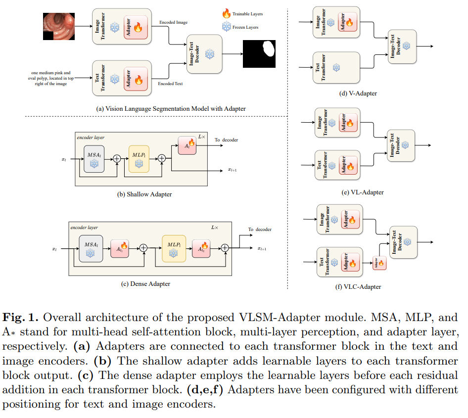
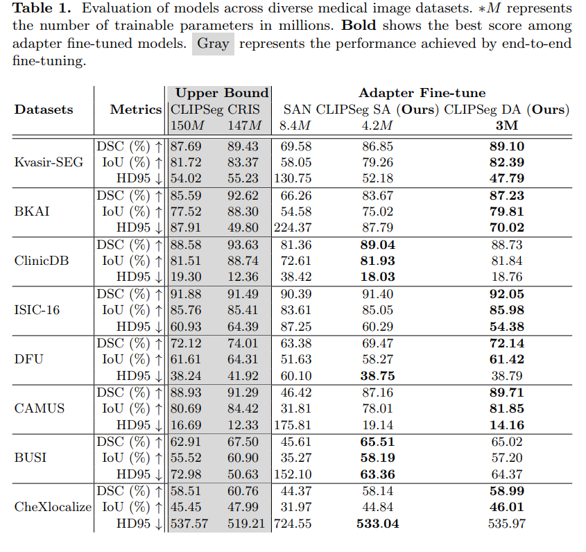

# VLSM-Adapter: Finetuning Vision-Language Segmentation Efficiently with Lightweight Blocks

- Paper: [arxiv.org/abs/2405.06196](https://www.arxiv.org/abs/2405.06196)


## Table of Contents
- [Methodology](#methodology)
- [Setup](#setup)
- [Finetuning](#finetuning)
- [Results](#results)
- [Citation](#citation)

## Methodology
<div style="text-align: center;">
  
  <p>Architecture of VLSM-Adapter.</p>
</div>

## Setup
Please refer to the [MedVLSM](https://github.com/naamiinepal/medvlsm/) repo for environment setup, pretrained model setup and dataset_preparation.


## Finetuning

If you need to run our fine-tuning models, you can use the provided script:
```bash
python scripts/finetune.py
```

This script will start the fine-tuning process, which is essential for customizing the model for specific tasks. 
In the file, all of the methods have been defined as bash scripts.
For running inference, please update the defaults configs (such as `ckpt_path`, `models`, etc.) in `scripts/inference.py` to get the evulation metric or generate the output masks (in the original resolution).

## Results
<div style="text-align: center;">
  
  <p>Results of VLSM-Adapter.</p>

### Acknowledgement
We would like to thank [Lightning-Hydra-Template](https://github.com/ashleve/lightning-hydra-template) for providing a modifiable framework for running multiple experiments while tracking the hyperparameters.